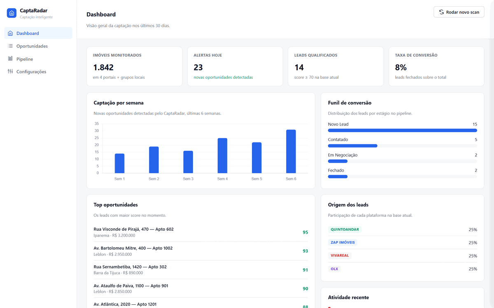
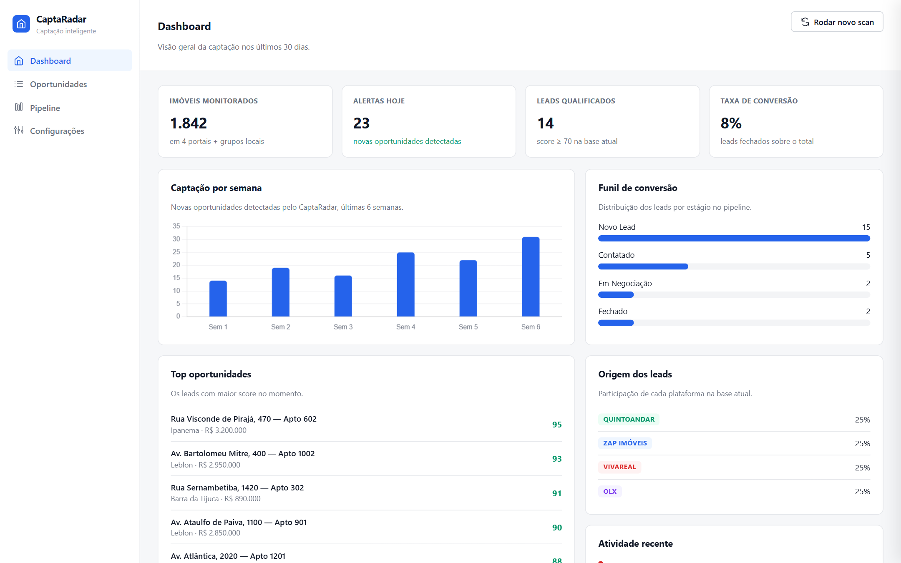
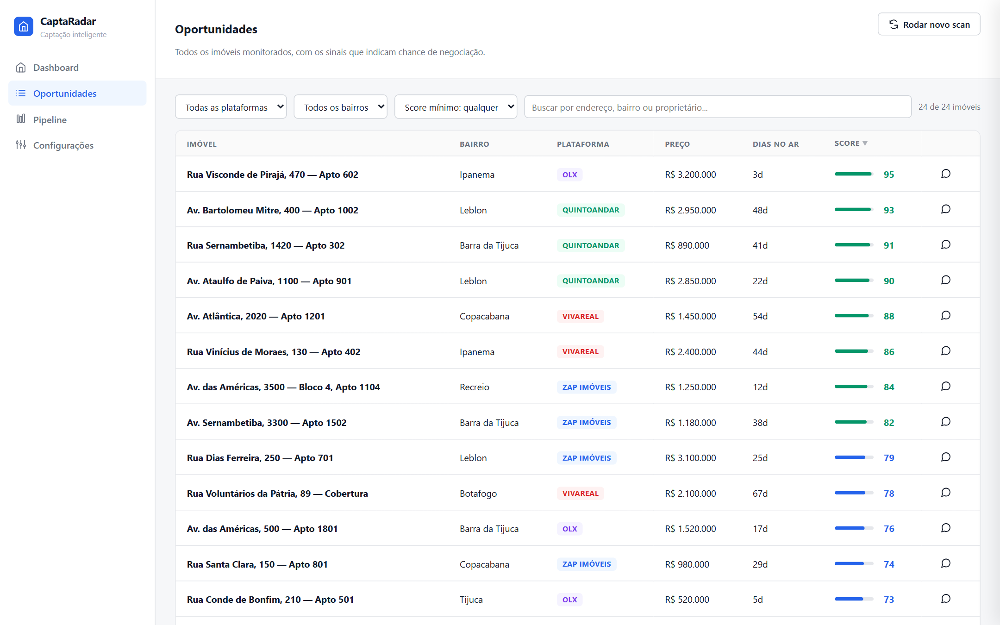
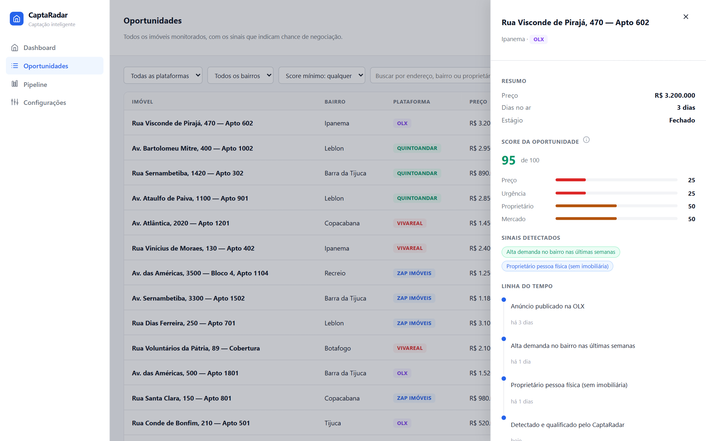
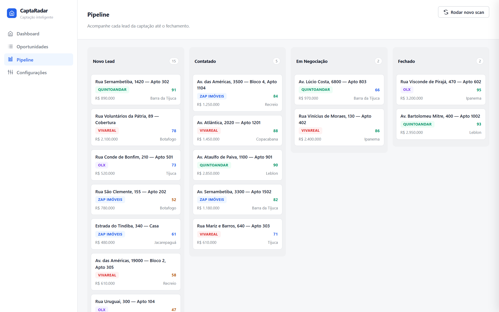
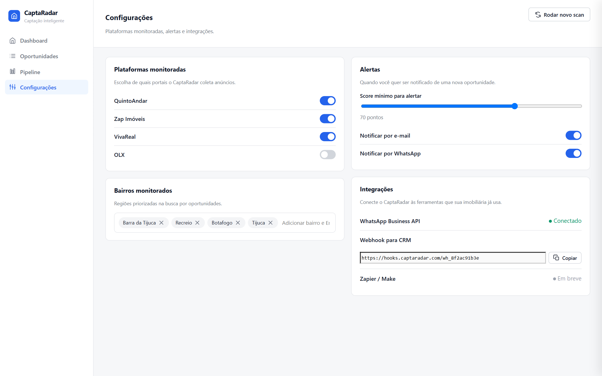

# 📡 CaptaRadar

**Radar de captação imobiliária.** Enquanto a captação tradicional depende de listas compradas e abordagem às cegas, o CaptaRadar monitora os anúncios públicos dos grandes portais, identifica os imóveis anunciados pelo próprio dono, lê a situação de cada anúncio e diz quem abordar primeiro, com a mensagem já escrita.

🔗 **Demo ao vivo:** [capta-radar.vercel.app](https://capta-radar.vercel.app) · entre com qualquer e-mail e a senha `imob2026`



---

## 💡 O problema

Imobiliárias que fazem captação ativa hoje:

- Compram **listas de condomínios** caras e desatualizadas
- Abordam proprietário **um a um, sem qualificação nenhuma**
- Esbarram num detalhe cruel dos portais: o contato que aparece no anúncio é quase sempre de **outra imobiliária ou corretor**, não do dono

Resultado: muito esforço, quase nenhuma conversão.

## ⚙️ Como o CaptaRadar resolve

| Passo | O que acontece |
|---|---|
| **1. Monitora** | Acompanha continuamente QuintoAndar, Zap Imóveis, VivaReal e OLX, registrando cada anúncio novo e cada alteração |
| **2. Filtra** | Exclui anúncios de imobiliárias e corretores conhecidos. Sobram os de **proprietário direto** (na prática, ~1 em cada 5) |
| **3. Lê a situação** | Cada anúncio ganha uma linha do tempo: dias no ar, republicações, mudanças de preço, migração entre portais |
| **4. Prioriza** | Essa leitura vira um **score de urgência de 0 a 100**: anúncio parado + preço caindo + repostado em 3 portais = dono pronto pra negociar |
| **5. Aborda** | A IA escreve a mensagem citando a situação real do imóvel, com tom calibrado pelo score, pronta pra abrir no WhatsApp |

## 🖥️ Telas

### Dashboard
Visão geral da operação: KPIs, captação por semana, funil de conversão, origem dos leads e atividade do radar em tempo real.



### Oportunidades
Todos os imóveis monitorados numa tabela ordenável, com filtros combináveis (portal, bairro, score, busca livre) e exportação em CSV.



### Raio-x do lead
Cada imóvel explica por que vale o contato: score aberto por fator (preço, urgência, proprietário, mercado), sinais detectados, linha do tempo do anúncio e sugestão de próxima ação.



### Pipeline
Kanban da captação: Novo Lead → Contatado → Em Negociação → Fechado. Arrasta o card e o estado persiste no navegador.



### Configurações
Portais monitorados, bairros prioritários, score mínimo de alerta e canal de notificação, além das integrações (WhatsApp Business API, webhook pra CRM).



## ✨ Detalhes que fazem diferença

- **Mensagem de IA por lead**: o botão de WhatsApp abre um modal com o texto de abordagem gerado a partir dos sinais daquele anúncio ("vi que seu imóvel está anunciado há 41 dias e o valor foi ajustado..."), com tom direto, consultivo ou suave conforme o score. Um clique e abre no WhatsApp com tudo pronto.
- **Scan ao vivo**: "Rodar novo scan" varre os portais e novas oportunidades entram na base na hora, com alerta no feed.
- **Login com sessão** e conta de demonstração.
- **Pipeline persistido**: o que você organiza fica salvo entre visitas (localStorage).
- **100% client-side**: a demo inteira é **um único arquivo HTML** (JS puro + Chart.js via CDN), sem backend, com dados representativos que espelham uma operação real de captação.

## 🧱 Stack

| Camada | Demo atual | Versão produção (planejada) |
|---|---|---|
| Front | HTML + CSS + JS puro, Chart.js | React + Tailwind |
| Dados | Mock representativo em memória | Supabase (Postgres) |
| Coleta | simulada (demo) | Scrapers por portal + fila de scan agendado |
| IA | Templates calibrados por score | LLM (Claude) pra leitura de sinais e geração de mensagem |
| Abordagem | Link `wa.me` com texto pronto | WhatsApp Business API oficial |
| Deploy | Vercel (estático) | Vercel + workers de coleta |

## 🚀 Rodando

Sem instalação: baixe o [`imob-radar-demo.html`](imob-radar-demo.html) e abra com duplo-clique no navegador. É isso.

Pra republicar a demo na Vercel:

```bash
cd deploy-demo
npx vercel deploy --prod --yes
```

## 📁 Estrutura

```
imob-radar-demo.html   ← demo publicada (com tela de login)
imob-radar.html        ← versão base sem login (usada pros prints)
imob-radar-mock.html   ← primeira versão do protótipo (histórico)
deploy-demo/           ← pasta publicada na Vercel
screenshots/           ← prints das 5 telas
captaradar-telas.gif   ← GIF de apresentação das telas
```

## 🗺️ Roadmap

- [x] Protótipo navegável com as 5 telas e dados representativos
- [x] Score de urgência com breakdown por fator
- [x] Mensagem de abordagem gerada por IA com tom calibrado
- [x] Demo pública com login
- [ ] Coleta real dos portais com linha do tempo por anúncio
- [ ] Geração de mensagem via LLM com dados reais
- [ ] Alertas por e-mail/WhatsApp por score mínimo
- [ ] Multiusuário com aprovação de acesso

---

Feito por [Caio Cruz](https://github.com/CaiioFe) · [maestriapro.com.br](https://maestriapro.com.br)
